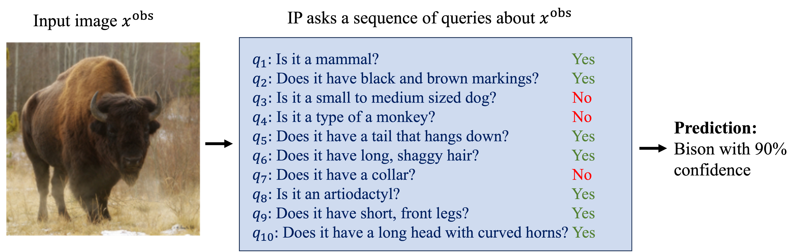

# Concept-QA+V-IP

**Aditya Chattopadhyay<sup>1</sup>, Kwan Ho Ryan Chan<sup>2</sup>, and René Vidal<sup>2</sup>** <br>

**¹Johns Hopkins University, USA, `achatto1 <at> jhu.edu`**

**²University of Pennsylvania, USA, `{ryanckh, vidalr} <at> seas.upenn.edu`**

Official code to accompany the paper [Bootstrapping Variational Information Pursuit with Large Language and Vision Models for Interpretable Image Classification (ICLR 2024)](https://openreview.net/forum?id=9bmTbVaA2A&noteId=IzZAQqhXHg).

## Overview
<p align="center">

</p>

Variational Information Pursuit (V-IP) is an interpretable-by-design framework that makes predictions by sequentially selecting a short chain of user-defined, interpretable queries about the data that are most informative for the task. The prediction is based solely on the obtained query answers, which also serve as a faithful explanation for the prediction. Applying the framework to any task requires (i) specification of a query set, and (ii) densely annotated data with query answers to train classifiers to answer queries at test time. This limits V-IP's application to small-scale tasks where manual data annotation is feasible. In this work, we focus on image classification tasks and propose to relieve this bottleneck by leveraging pretrained language and vision models. Specifically, following recent work, we propose to use GPT, a Large Language Model, to propose semantic concepts as queries for a given classification task. To answer these queries, we propose a light-weight Concept Question-Answering network (Concept-QA) which learns to answer binary queries about semantic concepts in images. We design pseudo-labels to train our Concept-QA model using GPT and CLIP (a Vision-Language Model). Empirically, we find our Concept-QA model to be competitive with state-of-the-art VQA models in terms of answering accuracy but with an order of magnitude fewer parameters. This allows for seamless integration of Concept-QA into the V-IP framework as a fast-answering mechanism. We name this method Concept-QA+V-IP. Finally, we show on several datasets that Concept-QA+V-IP produces shorter, interpretable query chains which are more accurate than V-IP trained with CLIP-based answering systems.


## Requirements
This project uses the `conda` package manager. Currently we only support Linux environments.
On Linux, type
```
conda env create -f environment.yml
```
Once this command has finished, you can activate the environment with `conda activate`.
 
We also use `wandb` to moderate training and testing performance. One may remove lines related to `wandb` and switch to other packages if they desire. 

## Datasets
This code supports 5 datasets: Cifar10, Cifar100, CUB-200, Places365 and Imagenet.

For CUB-200, please download the dataset from https://www.vision.caltech.edu/datasets/cub_200_2011/. Remember to save the dataset at "./data/CUB/", with the image directory being located at "./data/CUB/CUB_200_2011".

For Imagenet, refer to instructions at https://www.image-net.org/download.php. Remember to save the dataset at "./data/ImageNet".

## Code
For all code, we use argparse to take in arguments, use the '-h' flag to see description of arguments. For example, for code "train_concept_qa.py", typing "train_concept_qa.py -h" would display the list of arguments the code takes. Following are list of relevant codes.

1. **preprocess.py**: code to convert images from the Imagenet and Places365 datasets into their respective clip embeddings and save them as new datasets of (clip embedding, label) pairs. This is done to speed up the training on Concept-QA and V-IP networks since these are very large datasets. Run this file before running the below two codes for training the Concept-QA and V-IP networks respectively.
2. **train_concept_qa.py**: code to train the Concept-QA network. 
3. **train_vip.py**: code to train the V-IP network using the trained Concept-QA network (using the previous code). In this code, please change the filenames for the saved Concept-QA network file accordingly in the "get_answering_model()" function.
4. **VIP_visualizations.ipynb**: Code to visualize the interpretable prediction results by V-IP using the Concept-QA model. This code uses the saved models (used for generating results in our paper). If you train your own models using the above codes, remember to change the filenames accordingly, in the "get_pretrained_actor_classifier_filenames" function in utils.py and the "get_answering_model()" function in train_vip.py.

## License
This project is under the MIT License. See [LICENSE](./LISENSE.md) for details.


## Cite
If you find our work useful for your research, please cite:

```
@inproceedings{
chattopadhyay2024bootstrapping,
title={Bootstrapping Variational Information Pursuit with Foundation Models for Interpretable Image Classification},
author={Aditya Chattopadhyay and Kwan Ho Ryan Chan and Rene Vidal},
booktitle={The Twelfth International Conference on Learning Representations},
year={2024},
url={https://openreview.net/forum?id=9bmTbVaA2A}
}
```
